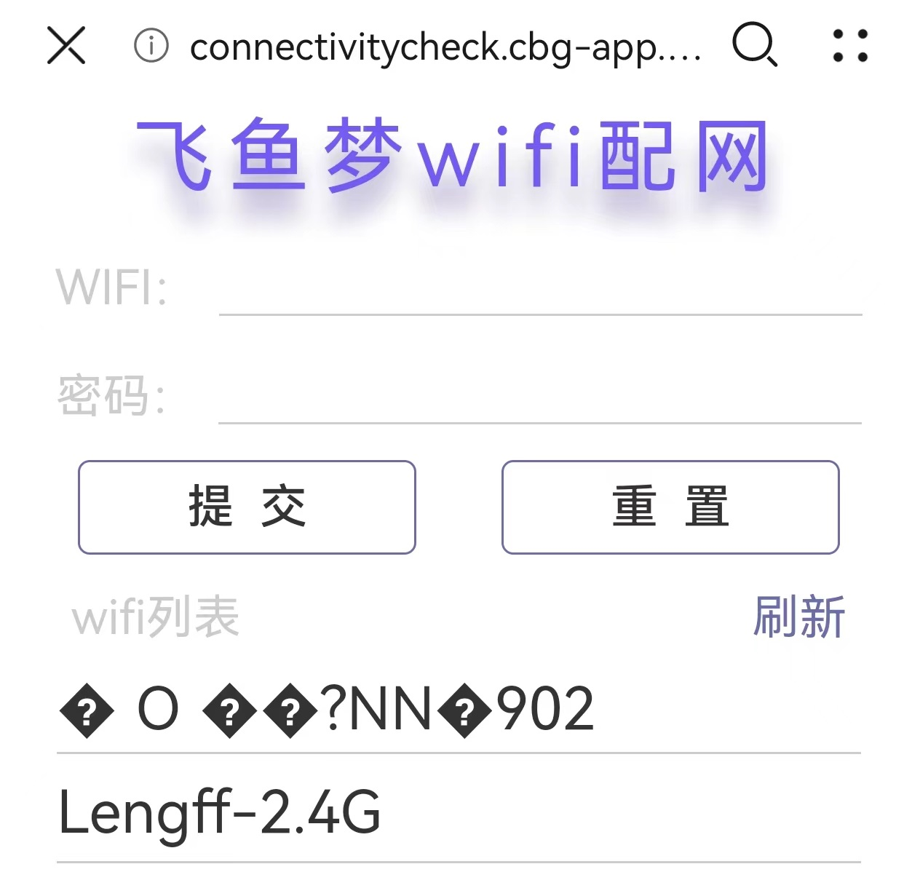

# 飞鱼USB开关说明


## 简介

随着各种各样的USB供电设备的出现，生活中经常会出现一种场景，那就是操作繁琐，每次都要插拔电源等等！
经常看到那种测电压电流功率的功率计，所以我就想着搞一个可以远程控制的USB开关。

我个人也有很多使用上的痛点：
1. 床头的一个小夜灯离我很远，每次关灯都要我把夜灯给拔掉，
2. 还有一个蓝牙音箱需要充电，但是我经常插着充电就忘记拔掉了，所以就想着搞一个定时的开关，解放双手
3. 还有一个抽水的电池坏了，必须插着线才能用，所以需要单独控制

所以才下定决定做一个这个USB开关，这个设备的功能也比较简单，算不上什么高级的东西，但是我也是没有看到有比较好用的开源作品，所以就自己做一个，做的不好让大家见笑。

## 推广自己

> 有你们的支持才是我们所有开源作者的动力，所以如果你有时间且愿意动动手指欢迎点点关注点点赞，让我们不断推陈出新，感激不尽

#### gitee项目地址:

介于github访问实在是太难了，所以首推gitee。

[gitee项目地址 fy-usb-switch-open](https://gitee.com/fly-fish-studio/fy-usb-switch-open)

#### 嘉立创项目地址：

[嘉立创项目地址 fy-usb-switch-open](https://oshwhub.com/fly-fish-studio/usb-kai-guan-jian-ce-dian-ya-dian-liu-esp8266-ina226)

## 功能

1. 电源开和关
   > 这个就是设备的核心功能，也是比较简单的功能，就是控制USB开关的电源开和关，实现用电器的电源通断
2. 电压电流功率信息查询
   > 能够在手机页面上查看实时的电压，电流，功率等信息，方便了解设备的工作状态
3. 接入点灯实现远程控制和小爱语音控制
   > 搞这个很大一部分原因就是想远程控制，接入小爱语音，实现语音控制和点灯的app控制。
4. 支持定时开关等操作
   > 定时开关支持两种方式: 
   1. 几点中开启几点钟关闭(每天都会执行)
   2. 倒计时关闭或者开启(即如果是开启状态则倒计时结束则关闭，反之则倒计时结束则开启)
5. 按键功能设置
    > 可以设置单击或者双击按键执行具体的操作逻辑

## 演示视频
待上传

## 原理图

板子使用立创EDA画的，所以需要知道原理图和PCB的小伙伴可以点击以下链接跳转到立创开源地址哦

#### 嘉立创PCB开源地址

[嘉立创PCB开源地址](https://oshwhub.com/fly-fish-studio/usb-kai-guan-jian-ce-dian-ya-dian-liu-esp8266-ina226)

#### 原理图


#### PCB预览


## 固件烧录
> 如果你不想下载代码烧录的话，可以选择直接烧录固件，这样简单便捷，需要焊接好板子即可。
todo


## 代码编译烧录

> 熟悉arduino的小伙伴就不需要看这里的说明，如果是对arduino代码编译这些还不太熟悉的小伙伴则可以往下看，我这里也是从之前其他地方拷贝过来的，描述的不对，还请多百度一下才行。


### 1. 软件和驱动安装
   这里由于我之前在点阵时钟的描述中介绍的比较清晰，所以这里不一一介绍了，请点击链接【 [Arduino软件安装及串口驱动安装说明](https://gitee.com/lengff/esp8266-lattice-clock-open#2--%E5%AE%89%E8%A3%85%E5%AF%B9%E5%BA%94%E7%9A%84%E8%BD%AF%E4%BB%B6) 】跳转到页面进行查看

### 2. 代码编译

#### 1. 安装所需要的依赖库文件
- 由于我也是初学者，很多都是使用别人的库文件，自己并没有去深入原理的去重写代码，所以我们需要安装一些库文件
- 安装步骤如下：
  1. `工具 --> 管理库 --> 搜索我们需要安装的库 --> 点击安装即可`
- 需要安装的库文件如下：
    1. `Blinker.h` 点灯科技提供的驱动库
    2. `OneButton` 按键控制的库
    3. `ArduinoJson` JSON内容解析的库
    4. `NTPClient` NTP时间校准的库
    4. `INA226` 功率计算芯片需要用到的库
- 如果有遗漏的库，请看报错提示，按错误提示将其中的库安装一下即可

#### 2. 下载源代码

- `github下载` 暂未上传到github
- `gitee下载` https://gitee.com/fly-fish-studio/fy-usb-switch-open

通过上面的地址下载我们的源码，其中代码在目录的`code`目录中，通过`arduino`直接打开`code`目录的文件夹即可。

#### 3. 烧录代码

- 通过`Arduino IDE`打开我们上一步下载好的代码
    1. `文件 --> 打开 --> 选择源码所在文件夹中.ino后缀的文件`
- 选择开发板
    1. `工具 --> 开发板 --> ESP8266 --> NodeMcu 1.0`
- 选择端口
    1. `工具 --> 端口 --> 选择我们串口设备对应的端口`
- 写入程序
    1. `项目 --> 上传 或 点左侧的 → 箭头 （波特率选115200，会快一些）`

## 使用说明

### 1. 设备配网

当你代码烧录完成以后需要做的第一件事情就是设备配网，为了提升配网的体验，目前使用的是`WiFi`网页配网。简单来说就是`ESP8266`设备会提供一个热点，手机连接该热点以后会自动弹出网页进行配网操作。

操作方法如下：

1. 时钟上电，然后会自己产生一个`FY-USB-SWITCH`热点
2. 用手机连接上述热点，然后就会自动弹出配网页面
3. 如果没有弹出来的话，那就自己到手机浏览器输入：`192.168.4.1`一样也会有配网页面
4. 按照页面提示即可完成配网



### 2. 打开设备操作页面


设备操作页面如上图，该页面的IP地址由于不方便获取，以下提供几种方法：

1. 路由器管理页面查看设备IP地址（大佬都会懂这个的）
2. 使用串口工具，查看串口打印的IP地址（这个比上面的麻烦一些）
3. 使用我提供的一个工具，点击该链接地址：[fy-switch-getip](http://lengff.com/lengff/fy-switch-getip.html) ，然后输入路由器IP地址，搜寻到设备会自动跳转


### 3. 点灯功能配置

熟悉使用点灯的小伙半应该不用看这里的教程了吧，嘻嘻嘻。如果你不熟悉使用点灯可以接着往下看。

##### 1. 获取点灯的secretKey

获取流程请看截图展示，这里偷懒没有最近去截图，用的是以前的图片，如果有出入请以实际的为准。

1. 进入首页点击右上角的＋ 

2. 点击点灯分类中的“独立设备”

3. 设备接入向导点击网络设备

4. 复制其中的key就是我们需要的点灯secretKey


##### 2. 配置点灯的secretKey

直接在操作页面的`绑定点灯SecretKey`那里粘贴上一步获取到的点灯`secretKey`，然后保存后点重启设备即可

##### 3. 导入点灯的操作界面

这一步也是比较简单的，需要复制界面代码，然后粘贴即可。

界面代码：
``` 
{¨version¨¨2.0.0¨¨config¨{¨headerColor¨¨transparent¨¨headerStyle¨¨dark¨¨background¨{¨img¨¨assets/img/bg/1.jpg¨}}¨dashboard¨|{¨type¨¨btn¨¨ico¨¨fad fa-power-off¨¨mode¨Ê¨t0¨¨开关USB¨¨t1¨¨文本2¨¨bg¨É¨cols¨Í¨rows¨Í¨key¨¨btn-enable¨´x´É´y´Ë¨lstyle¨Ë}{ßB¨cha¨ßKɨsty¨¨line¨¨clr¨¨#00A90C¨¨sty1¨ßS¨clr1¨¨#076EEF¨¨sty2¨ßS¨clr2¨¨#EA0909¨ßLÑßMÍßN¨cha-hgb¨´x´É´y´ÏßPÊßG¨电压¨ßI¨电流¨¨t2¨¨功率¨¨key1¨¨chat-a¨¨key0¨¨chat-v¨¨key2¨¨chat-p¨}{ßBßCßD¨fal fa-power-off¨ßFÊßG¨启用指示灯¨ßIßJßKÉßLÍßMÍßN¨btn-led¨´x´Í´y´ËßPË}÷¨actions¨|÷¨triggers¨|÷¨rt¨|÷}
```

操作步骤如下图所示：
1. 点击右上角的三个点

2. 点击界面配置

3. 清空原来的内容，粘贴上述代码


### 4. 小爱语音配置

这里的小爱语音是指可以使用小爱同学，通过语音控制设备（并不能在米家设备中展示），所以有这个需求的可以考虑使用该功能，我自己也一直在用，使用起来体验还是可以的。

操作步骤如下：
1. 打开`米家App`。通过`我的 --> 其他平台设备 --> 点击添加 --> 点灯科技 --> 绑定账号 ，绑定blinker（点灯平台）账号`
2. 绑定成功后，支持小爱控制的`blinker`设备会出现在 `我的 --> 其他平台设备 --> 点灯科技 --> 设备列表中`
3. 现在可以使用小爱控制该设备了（其实设备名称就是设备，比如你点灯的设备叫USB开关，就可以对小爱同学说`打开/关闭USB开关`）
